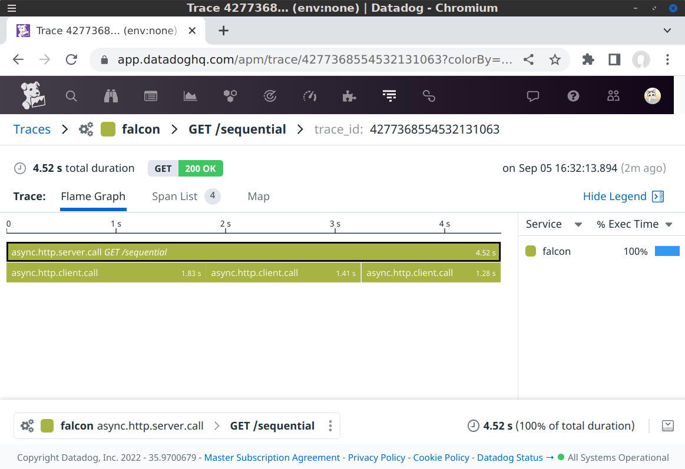

# Fanout

Executing operations sequentially adds the latency together. Executing operations concurrently is as slow as the slowest operation.

Depending on your use case, it can be a big advantage to run concurrent operations.

